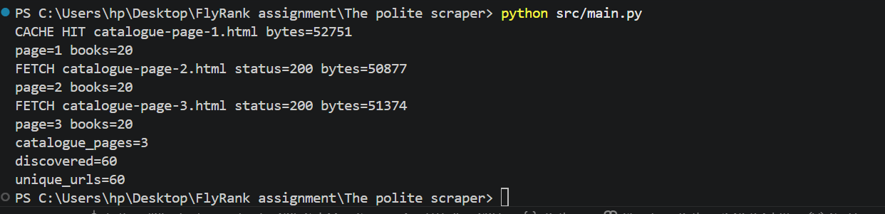

# The Polite Scraper

## Stage 0 — Target Classification

### Target

The target for this assignment is **Books to Scrape**:

https://books.toscrape.com/

Books to Scrape is part of the **ToScrape Web Scraping Sandbox**, a practice environment specifically designed for people learning and testing web scraping.

### Scope

This scraper will only process:

- The first **3 catalogue pages**
- The **60 unique books** discovered from those pages

The scraper will collect only the data required for the assignment, including the book title, URL, price, availability, rating, description, source page, and fetch timestamp.

### robots.txt

I checked:

https://books.toscrape.com/robots.txt

The URL returned **404 Not Found**, meaning that no `robots.txt` file was found for the Books to Scrape site.

A missing `robots.txt` file is not treated as permission to scrape other websites. This assignment is limited to Books to Scrape because it is explicitly provided as a scraping practice sandbox.

> I will not reuse this code on another site without checking its rules and terms first.

## Stage 1 — Fetch and Cache HTML

The first catalogue page was fetched using a polite HTTP request with:

- An identifying `User-Agent`
- A request timeout
- Status-code validation
- A local cache to avoid repeatedly requesting the website during development

The first run fetched the page successfully:

```text
FETCH status=200 bytes=50469
```

The HTML was then saved to:

```text
cache/catalogue-page-1.html
```

On the second run, the scraper detected the cached page and did not make another request to the website:

```text
CACHE HIT bytes=52751
```

This means subsequent development runs can use the cached HTML instead of repeatedly requesting the live site.

### Checkpoint

- First run: `FETCH` with HTTP `200`
- HTML successfully cached locally
- Second run: `CACHE HIT`
- Response size is reported
- The full HTML is not printed to the terminal

### Stage 2 — Discover the Three Catalogue Pages

The scraper now parses the cached catalogue pages using **Beautiful Soup** and discovers the book links from each page.

For each book, the relative URL is converted into an absolute URL using `urljoin()` rather than manually concatenating strings.

The scraper follows the catalogue's own **Next** link to discover:

- Catalogue page 1
- Catalogue page 2
- Catalogue page 3

Each catalogue page contains 20 books, giving a total of **60 discovered book URLs**.

The scraper also removes duplicate URLs before continuing to the next stage.

Cached catalogue pages are reused on subsequent runs, so the website is not contacted unnecessarily during development.

**Screenshot:**



The result confirms that the scraper discovered exactly **60 unique book URLs across the first three catalogue pages**.