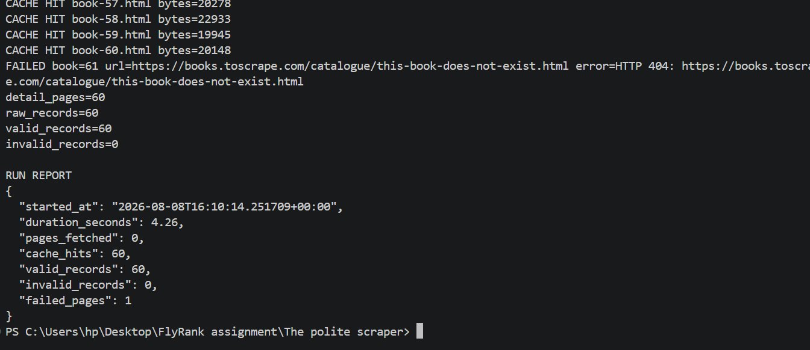

# The Polite Scraper

## Stage 0 — Target Classification

### Target

The target for this assignment is **Books to Scrape**:

https://books.toscrape.com/

Books to Scrape is part of the **ToScrape Web Scraping Sandbox**, a practice environment specifically designed for people learning and testing web scraping.

### Scope

This scraper will only process:

- The first **3 catalogue pages**
- The **60 unique books** discovered from those pages

The scraper will collect only the data required for the assignment, including the book title, URL, price, availability, rating, description, source page, and fetch timestamp.

### robots.txt

I checked:

https://books.toscrape.com/robots.txt

The URL returned **404 Not Found**, meaning that no `robots.txt` file was found for the Books to Scrape site.

A missing `robots.txt` file is not treated as permission to scrape other websites. This assignment is limited to Books to Scrape because it is explicitly provided as a scraping practice sandbox.

> I will not reuse this code on another site without checking its rules and terms first.

## Stage 1 — Fetch and Cache HTML

The first catalogue page was fetched using a polite HTTP request with:

- An identifying `User-Agent`
- A request timeout
- Status-code validation
- A local cache to avoid repeatedly requesting the website during development

The first run fetched the page successfully:

```text
FETCH status=200 bytes=50469
```

The HTML was then saved to:

```text
cache/catalogue-page-1.html
```

On the second run, the scraper detected the cached page and did not make another request to the website:

```text
CACHE HIT bytes=52751
```

This means subsequent development runs can use the cached HTML instead of repeatedly requesting the live site.

### Checkpoint

- First run: `FETCH` with HTTP `200`
- HTML successfully cached locally
- Second run: `CACHE HIT`
- Response size is reported
- The full HTML is not printed to the terminal

### Stage 2 — Discover the Three Catalogue Pages

The scraper now parses the cached catalogue pages using **Beautiful Soup** and discovers the book links from each page.

For each book, the relative URL is converted into an absolute URL using `urljoin()` rather than manually concatenating strings.

The scraper follows the catalogue's own **Next** link to discover:

- Catalogue page 1
- Catalogue page 2
- Catalogue page 3

Each catalogue page contains 20 books, giving a total of **60 discovered book URLs**.

The scraper also removes duplicate URLs before continuing to the next stage.

Cached catalogue pages are reused on subsequent runs, so the website is not contacted unnecessarily during development.

**Screenshot:**


The result confirms that the scraper discovered exactly **60 unique book URLs across the first three catalogue pages**.

### Stage 3 — Extract Raw Book Records 

The 60 unique book URLs discovered in Stage 2 were used to fetch each book's detail page.

Each detail page is:

- fetched with the same identifying `User-Agent`
- protected by a 10-second timeout
- checked for an HTTP `200` response
- delayed by at least `0.5` seconds before a real request
- cached locally in `cache/details/`
- parsed using Beautiful Soup

The extractor targets the product section of each page rather than searching the entire HTML document.

Each raw record contains:

```json
{
  "title": "A Light in the Attic",
  "product_url": "https://books.toscrape.com/catalogue/a-light-in-the-attic_1000/index.html",
  "price_text": "£51.77",
  "availability_text": "In stock (22 available)",
  "rating_text": "Three",
  "description": "...",
  "source_page": "https://books.toscrape.com/catalogue/page-1.html",
  "fetched_at": "2026-08-08T15:28:34+00:00"
}
```

The `description` field is allowed to be `null` when the page does not contain a description. No missing information is invented.

The `source_page` and `fetched_at` fields provide provenance, showing where the book was discovered and when its detail page was fetched.


**Screenshot:**


### Stage 4 — Clean, Validate, and Store the Records

The raw book records collected in Stage 3 were cleaned and validated before being stored.

#### Normalize the Price

The original `price_text` value is kept, while a numeric `price_gbp` field is added so the price can be processed programmatically.

For example:

```json
{
  "price_text": "£51.77",
  "price_gbp": 51.77
}
```

The absolute `product_url` is used as the unique identity of each book, preventing duplicate records.

#### Validate with Pydantic

A Pydantic schema defines the expected structure and types of each record.

Each extracted record is validated before being stored. Invalid records are written to `output/errors.json` together with the reason for the validation failure.

Valid records are written to:

```text
output/books.json
```

The resulting records contain the cleaned and validated data, including:

- `title`
- `product_url`
- `price_text`
- `price_gbp`
- `availability_text`
- `rating_text`
- `description`
- `source_page`
- `fetched_at`

#### Checkpoint

The scraper successfully validated all 60 discovered books:

```text
detail_pages=60
raw_records=60
valid_records=60
invalid_records=0
```

The scraper was then executed a second time to verify **idempotency**.

After the second run:

```text
output/books.json → 60 records
```

The number of records remained 60 instead of increasing to 120, confirming that duplicate records are not created when the scraper is run again.


**Screenshot:**


## Stage 5 — Survive Failures & Report the Run

### Goal

A single broken book page should not terminate the entire scraping job.

This stage makes the scraper resilient to individual page failures and produces a run report containing honest execution statistics.

### What was implemented

#### 1. Per-page failure handling

Each book detail page is processed independently.

If one page fails, the scraper:

- Logs the failed URL.
- Records the error.
- Skips the broken page.
- Continues processing the remaining books.
- Does not allow one failure to terminate the entire run.

For example, a deliberately invalid URL was added for testing:

```text
FAILED book=61 url=https://books.toscrape.com/catalogue/this-book-does-not-exist.html error=HTTP 404
```

The scraper continued normally after the 404.

#### 2. Retry policy

Transient failures such as:

- Request timeouts
- HTTP 5xx server errors

are suitable for a retry.

Permanent client errors such as:

- `403 Forbidden`
- `404 Not Found`

are not retried because repeating the request will not fix the problem.

This keeps the scraper polite while still providing resilience against temporary server problems.

#### 3. Run reporting

At the end of each execution, the scraper generates:

```text
output/run-report.json
```

The report records:

- `started_at`
- `duration_seconds`
- `pages_fetched`
- `cache_hits`
- `valid_records`
- `invalid_records`
- `failed_pages`

Example report from the failure test:

```json
{
  "started_at": "2026-08-08T16:10:14.251709+00:00",
  "duration_seconds": 4.26,
  "pages_fetched": 0,
  "cache_hits": 60,
  "valid_records": 60,
  "invalid_records": 0,
  "failed_pages": 1
}
```

### Failure Test

To verify that one bad page does not kill the run, a fake book URL was intentionally added to the discovered list.

The scraper produced:

```text
FAILED book=61 ... HTTP 404
detail_pages=60
raw_records=60
valid_records=60
invalid_records=0
failed_pages=1
```

This proves that the invalid page was isolated while the 60 valid records were successfully preserved.

**Screenshot:**



### Caching

The test also confirms that previously downloaded pages are reused:

```text
CACHE HIT book-1.html
CACHE HIT book-2.html
...
CACHE HIT book-60.html
```

No unnecessary requests were made for cached pages.

## Stage 6 — Publish Scraper Evidence

### Reproducibility

The scraper is packaged so that another developer can clone the repository, install the required Python dependencies, and run the scraper with a single command.

### Installation

Clone the repository and enter the project directory:

```bash
git clone https://github.com/fatimIB/The-polite-scraper
cd The-polite-scraper
```

Install the required dependencies:

```bash
pip install -r requirements.txt
```

### Run

Run the scraper with:

```bash
python src/main.py
```

The scraper produces:

```text
output/
├── books.json
├── errors.json
└── run-report.json
```

The cache is stored locally under:

```text
cache/
```

and is excluded from version control using `.gitignore`.

### Record Schema

Each validated book record follows this structure:

```json
{
  "title": "A Light in the Attic",
  "product_url": "https://books.toscrape.com/catalogue/a-light-in-the-attic_1000/index.html",
  "price_text": "£51.77",
  "price_gbp": 51.77,
  "availability_text": "In stock (22 available)",
  "rating_text": "Three",
  "description": "...",
  "source_page": "https://books.toscrape.com/catalogue/page-1.html",
  "fetched_at": "2026-08-08T15:28:34+00:00"
}
```

The schema is enforced with Pydantic before records are written to `output/books.json`.

### Politeness Rules

The scraper follows several rules to reduce unnecessary load on the target website:

- **User-Agent:** requests identify the scraper with a descriptive `User-Agent`.
- **Timeout:** HTTP requests use a 10-second timeout so they never wait indefinitely.
- **Delay:** real requests to the website are separated by at least 0.5 seconds.
- **Caching:** downloaded catalogue and book pages are stored locally and reused during development.
- **Status checking:** only successful HTTP responses are parsed.
- **No unnecessary requests:** cached pages are never requested again.

### Browser Decision

A browser was not necessary for this assignment because the required data is already present in the HTML returned by the server. Browser automation would therefore add complexity and cost without providing additional information.

### Limitation

This scraper is intentionally limited to the first three catalogue pages and therefore collects only 60 books. It is not designed to crawl the entire Books to Scrape catalogue.

Another limitation is that the scraper depends on the current HTML structure of the website. If the site's markup or CSS selectors change, the extraction logic may need to be updated.

### Ethics

This project is intended for a public scraping sandbox and follows a conservative approach to web scraping.

When an official API exists, it should be preferred over scraping. The scraper does not attempt to bypass logins, paywalls, access controls, or blocks. It collects only the information required for the assignment and avoids unnecessary requests through caching and request delays.

### Final Evidence

A final run produces a `run-report.json` containing the execution statistics.

Example:

```json
{
  "started_at": "...",
  "duration_seconds": 4.26,
  "pages_fetched": 0,
  "cache_hits": 60,
  "valid_records": 60,
  "invalid_records": 0,
  "failed_pages": 1
}
```

The final output should contain exactly:

```text
60 validated book records
```

and the run report should confirm:

```text
valid_records = 60
failed_pages = 1
```

The Stage 5 failure test separately demonstrated that an intentionally invalid page does not terminate the run and is reported as a failed page.

### Project Structure

```text
The-polite-scraper/
│
├── src/
│   └── main.py
│
├── output/
│   ├── books.json
│   ├── errors.json
│   └── run-report.json
│
├── cache/   # ignored by Git
│
├── screenshots/                 
│
├── .gitignore
├── requirements.txt
└── README.md
```

